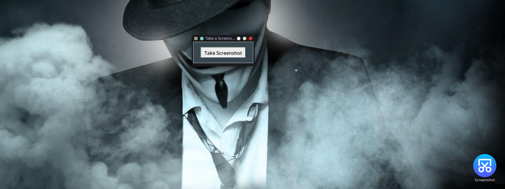

# Screenshot
 Simple PYscript with GUI to take a screenshot.

 

 ## Requierments
- import numpy as np
- import cv2
- import pyautogui

## Pre-install:

```
git clone https://github.com/ramackersjp/Screenshot/station.git
cd Screenshot
./Take-Screenshot.sh
```
chmod +x Take-Screenshot.sh

## Run
To take a screenshot open the app.py file in terminal and type the following commandline: 

```
python ./app.py
```
Quicklaunch (Single command): 

```
bash <(curl -L raw.githubusercontent.com/ramackersjp/Screenshot/main/src/app.py)
```

Option 2 (Execute Take-Screenshot.sh):
Take a screenshot by dubble clicking on the Take-Screenshot.sh file. (Don't forget to change the path in the Take-Screenshot.sh when you placing the file on another place):
```
To execute: Dubble click left mouse: Take-Screenshot.sh
```
## Image save location:
The place where you can find your screenshot.
```
images are saved at the src map. Or select your own location.
```
## Contribute:
If you want to contribute to this project, please create a branch from the beta version and pull it there. When the beta branch is fully where we want we merging the beta branch to the main branch.
